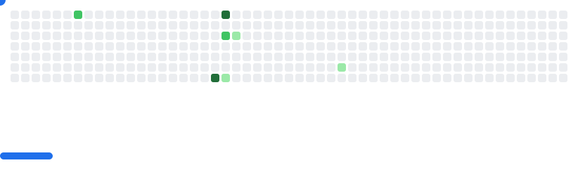

# 🐍 Dheeraj Sharma | Python Backend Wizard 

<div align="center">

</div>

<!-- Breakout Game Animation -->
<div align="center">
  <picture>
    <source media="(prefers-color-scheme: dark)" srcset="images/breakout-dark.svg">
    <source media="(prefers-color-scheme: light)" srcset="images/breakout-light.svg">
    
  </picture>
</div>

## 🚀 About Me

```python
class DheerajSharma:
    def __init__(self):
        self.name = "Dheeraj Sharma"
        self.role = "Python Backend Developer"
        self.language_spoken = ["Hindi", "en_US"]
        self.code = {
            "backend": ["Python", "Django", "DRF", "FastAPI"],
            "database": ["PostgreSQL", "MySQL", "MongoDB"],
            "devops": ["Docker", "GitHub Actions", "AWS"],
            "ml/ai": ["NLP", "scikit-learn", "TensorFlow"]
        }
        
    def say_hi(self):
        print("Thanks for dropping by! Let's build something amazing together!")

me = DheerajSharma()
me.say_hi()
```

## 🛠️ Tech Stack

<div align="center">
  


</div>

## 📊 GitHub Stats

<div align="center">
  


</div>

<!-- Profile Views Counter -->
<div align="center">
  
</div>

---

<div align="center">
  <i>🎯 If you can dream it, you can code it!</i>
</div>
