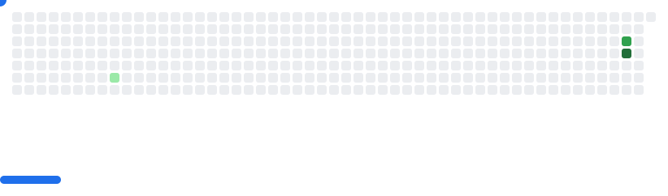

<!--
════════════════════════════════════════════════════════════════════
  Dheeraj Sharma · GitHub Profile README
  ────────────────────────────────────────────────────────────────
  BEFORE YOU COMMIT — 2 things:

    1. STATS: the cards in the ~/stats section are generated by the
       generate-stats.yml Action and committed into this repo. They stay
       blank until you've (a) added .github/workflows/generate-stats.yml
       and (b) run it once from the repo's Actions tab. The image URLs
       assume your default branch is "main" — if it's "master", swap
       every /main/ for /master/ in the ~/stats section.

    2. 👉 CONNECT: add your real email + LinkedIn (both marked below).

  To reskin the stat cards, change the theme word (tokyonight) in the
  ~/stats URLs to any of: github_dark · dracula · radical · nord_dark ·
  vue · monokai · solarized_dark  (the Action generates every theme).
════════════════════════════════════════════════════════════════════
-->

<!-- ─────────────────────────  HEADER  ───────────────────────── -->
<div align="center">


<a href="https://github.com/Dj-1000">
  
</a>

</div>

<!-- ─────────────────────  CONTRIBUTION BREAKOUT  ───────────────────── -->
<div align="center">
  <picture>
    <source media="(prefers-color-scheme: dark)" srcset="images/breakout-dark.svg">
    <source media="(prefers-color-scheme: light)" srcset="images/breakout-light.svg">
    
  </picture>
</div>

<br>

<!-- ─────────────────────────  ABOUT  ───────────────────────── -->
## `~/whoami`

I'm a **Python backend developer** who likes the unglamorous part of software: clean data models, predictable APIs, and services that keep running after you stop looking at them. I work mostly across the **Django / DRF / FastAPI** stack, and I'm just as happy in a **Jupyter notebook** exploring a dataset as I am wiring up an endpoint.

```python
class DheerajSharma:
    role      = "Python Backend Developer"
    focus     = ["REST APIs", "data models", "automation", "applied ML"]
    stack     = ["Django", "DRF", "FastAPI", "PostgreSQL", "Docker"]
    learning  = ["system design", "scalable backends", "LLM apps"]
    languages = ["Hindi", "English"]

    def open_to(self):
        return "backend roles · collaboration · interesting problems"
```

<br>

<!-- ─────────────────────────  TECH STACK  ───────────────────────── -->
## `~/stack`

**Backend**


**Data & ML**


**DevOps & Tools**


<br>

<!-- ─────────────────────────  PROJECTS  ───────────────────────── -->
## `~/selected-work`

<!-- A clean table never breaks. Edit descriptions to match reality. -->

| Project | What it is | Built with |
|---|---|---|
| **[djchat](https://github.com/Dj-1000/djchat)** `realtime` | A chat application backend — auth, message handling, and the API layer behind a Discord-style app. | `Python` `Django` `DRF` |
| **[Project-X_django-forms](https://github.com/Dj-1000/Project-X_django-forms)** `web` | Server-rendered Django flows: forms, validation, and clean model-to-template wiring. | `Python` `Django` |
| **[langchain_chatbot](https://github.com/Dj-1000/langchain_chatbot)** `llm` | A chatbot that orchestrates an LLM with LangChain — prompts, chains, and conversational memory. | `Python` `LangChain` |
| **[bostonhousing](https://github.com/Dj-1000/bostonhousing)** `ml` | Housing-price regression: exploratory analysis, feature work, and model training in a notebook. | `Python` `scikit-learn` |

<div align="right"><sub><a href="https://github.com/Dj-1000?tab=repositories">→ all repositories</a></sub></div>

<br>

<!-- ─────────────────────────  STATS  ───────────────────────── -->
## `~/stats`

<div align="center">

<!-- Streak: separate healthy service, keep as-is -->


<br><br>

<!--
  Cards below are generated by generate-stats.yml and committed to this repo,
  so viewing your profile never makes a live API call — nothing to rate-limit.
  They render only AFTER you've run the Action once (repo → Actions → Run workflow).
  Branch is assumed to be "main"; change /main/ to /master/ if yours is master.
-->


</div>

<br>

<!-- ─────────────────────────  CONNECT  ───────────────────────── -->
## `~/connect`

<div align="center">

<!-- 👉 Add your real links below. -->
<a href="https://www.linkedin.com/in/djsharma/"></a>
<a href="mailto:djsharma1000@gmail.com"></a>
<a href="https://github.com/Dj-1000"></a>

<br><br>


</div>

<div align="center">
  
  <sub><i>If you can dream it, you can code it.</i></sub>
</div>
